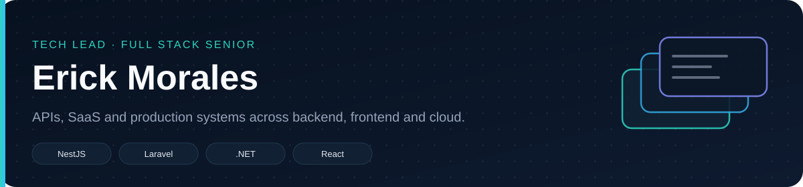
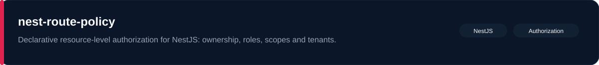
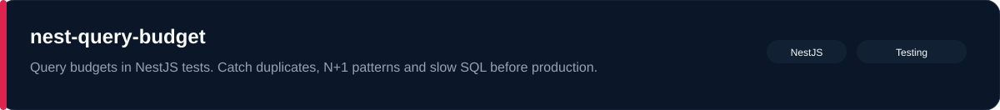
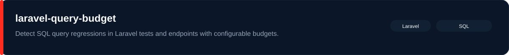
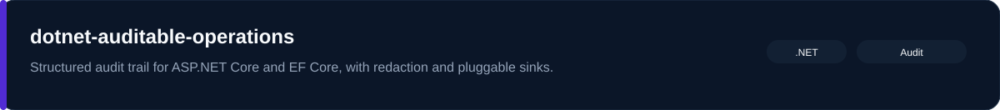
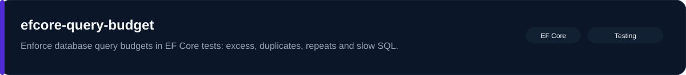
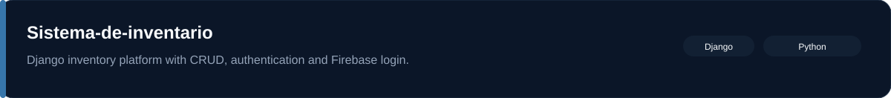
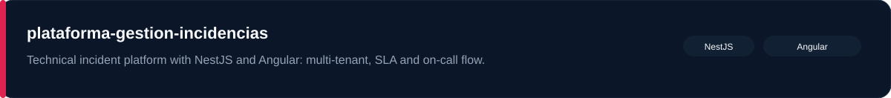
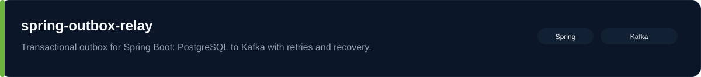
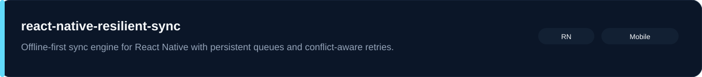

<table>
  <tr>
    <td valign="middle" width="190">
      

        
      

    </td>
    <td valign="middle">
      
    </td>
  </tr>
</table>

I build production backends, web platforms and mobile clients. From SaaS and APIs to libraries I actually use on those projects.

## Featured

## Platforms and apps

## Pinned

These follow the repositories you pin on GitHub. Change them in **Customize your pins**; this block updates on its own.

<!-- START:PINNED -->
 

 

 
<!-- END:PINNED -->

## More

<!-- START:MORE -->
 

 

 
<!-- END:MORE -->

## Stack

## GitHub

